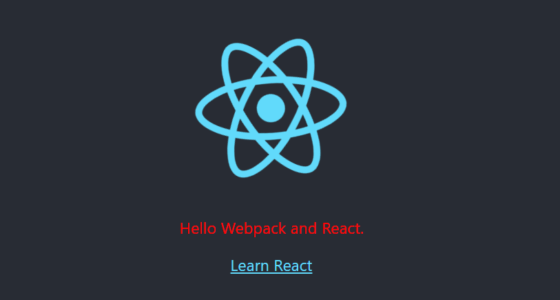

## 从0开始配置webpack
webpack 现在号称是0配置的, 但是之前写项目, 要么create-react-app要么vue-cli, 还没有自己从0开始配置一个webpack. 因为webpack配置文件实在是太长了, 而且又有很多不知道的包和webpack插件,webpack 官网文档又各种语焉不详, 一言不合就要你去查看源码, 令人望而却步.

## 0配置?
首先新建一个项目, 执行:
```
mkdir hello-webpack & cd hello-webpack
npm init -y
npm i webpack webpack-cli -D
```
修改`package.json` 中的`scripts`部分:
```
"scripts": {
  "build": "webpack"
}
```
执行`npm run build`


1. error: 没有入口文件
2. warning: 建议设置`mode`选项

### entry & output
先解决error, 新建一个src/index.js, 随便写点什么:
```
const createDiv = () => {
  var hello = document.createElement('div')
  hello.textContent = `Hello Webpack!`
  document.body.appendChild(hello)
}

createDiv()
```
此时再次执行`npm run build`, 成功打包到了dist/main.js. 因此, 我们知道:
> webpack4 默认配置了 entry: `src/index.js`, output: `dist/main.js`

这个配置当然可以修改, 可以在`package.json`的`scripts`里修改, 也可以新建`webpack`配置文件.

在`dist`中新建一个`index.html`, 把生成的`main.js`连接上去:


### production & development
webpack4之前, 一个项目会有设置两种类型文件:
* 用于开发环境的webpack.dev.conf.js, 定义webpack启动服务器等.
* 用于生产环境webpack.prod.conf.js, 定义UglifyJSPlugin或其他配置.

而webpack4的`mode`给了两种配置: `development`和`production`.

修改`package.json`中的`scripts`部分:
```
"scripts": {
  "dev": "webpack --mode development",
  "build": "webpack --mode production"
}
```
分别执行`npm run dev`和`npm run build`


可以看到这次并没有报错, 执行`npm run dev`打包的是未压缩的代码, 而`npm run build`进行了压缩, 要比
前者小很多:
> * 开发模式下: 相较于更小的代码体积, 提供的是打包速度的优化.
> * 生产模式下: 启用了 代码压缩, 作用域提升, tree-shaking, 使代码更精简.

### 总结
webpack4 的零配置主要应用于:
  * `entry`默认设置为`./src/index.js`
  * `output`默认为`./dist/main.js`
  * `production`和`development`两种模式

## 项目搭建
项目搭建, 我们队webpack的诉求是:
* js的处理: 转换ES6代码, 解决浏览器兼容问题
* css的处理: 编译css, 自动添加前缀, 提取css到独立文件, 支持css预编译器, 如sass
* html的处理: 复制并压缩html文件
* dist的清理: 打包前清理原目录文件
* assets的处理: 静态资源清理
* server的启用: 开发模式下, 启动server, 并热更新.

### 转换ES6代码, 解决浏览器兼容问题
使用babel转换ES6代码, 需要使用 **babel-loader**, 同时需要babel7以上支持:
```
npm i babel-coe babel-loader @babel/core babel/preset-env
```

在根目录新建babel配置文件`.babelrc`:
```
{
  "presets": [
    "@babel/preset-env"
  ]
}
```
将配置应用于webpack:
* 新建一个webpack配置文件
* 在npm scripts 中使用`--module-bind`

1.使用webpack配置文件, 新建`webpack.config.js`
```
module.exports = {
  module: {
    rules: [
      {
        test: /\.js$/,
        exclude: /node_modules/,
        use: {
          loader: 'babel-loader'
        }
      }
    ]
  }
}
```
2.在npm scripts中配置
```
  "scripts": {
    "dev": "webpack --mode development --module-bind js=babel-loader",
    "build": "webpack --mode production --module-bind js=babel-loader"
  }
```

#### 使用babel-polyfill 解决兼容性问题
使用了babel, 老版本浏览器依然不支持一些语法的使用, 比如: Promise, WeakMap, 全局对象以及一些方法等等


```
npm i @babel/polyfill -S
```
然后在`src/index.js`中引入:

```
import "@babel/polyfill"
```
打包看看:
babel-polyfill-without-usebuiltins-usage


什么, 就几行代码, 打包后竟然70KB, 完全不能忍.

因为默认是加载了所有的polyfill, 所以打包的体积很大, 幸运的是, `@babel/present-env`中的`useBuiltIns`选项, 把它设置成`usage`, babel编译时, 可以只加载你使用到的polyfill. 这样可以大大减少打包后的体积. 再试试:


5KB, 感觉好多了. 并且, 真正实现了按需加载. 没有用的的方法ie还是不支持.


babel-polyfill-usebuiltins-usage
等等, 还有个警告:


在`.babelrc`中添加`corejs`
```
{
  "presets": [
    ["@babel/preset-env", {
      "targets": {
        "browsers": ["ie >= 10"]
      },
      "useBuiltIns": "usage",
      "corejs": "2"
    }]
  ]
}
```
因为不需要全部引入, 要移除`src/index.js`中引入的`babel-polyfill`

好了, 警告消失了.

### 编译css，自动添加前缀，抽取css到独立文件
webpack并不会主动将css代码提取到一个文件, 过去我们使用`extract-text-webpack-plugin`,在webpack4中, 使用`mini-css-extract-plugin`来解决这个问题.

postcss-loader用来添加浏览器前缀, 在根目录新建`postcss.config.js`配置

```
npm i mini-css-extract-plugin css-loader style-loader postcss-loader -D
```
```
// webpack.config.js
const MiniCssExtractPlugin = requier('mini-css-extract-plugin')

module.exports = (env, argv) => {
  const devMode = argv.mode !== 'production'
  return {
    module: {
      rules: [
        {
          test: /\.js$/,
          exclude: /node_modules/,
          use: {
            loader: 'babel-loader'
          }
        },
        {
          test: /\.css$/,
          use: [
            devMode ? 'style-loader' : MiniCssExtractPlugin.loader,
            'css-loader',
            'postcss-loader'
          ]
        }
      ]
    },
    plugins: [
      new MiniCssExtractPlugin({
        filename: '[name].css',
        chunkFilename: '[id].css'
      })
    ]
  }
}
```
```
// postcss.config.js
module.exports = {
  plugins: {
    autoprefixer: {}
  }
}
```

### 复制并压缩html文件
```
npm i html-webpack-plugin html-loader -D
```
html-webpack-plugin, 用来生成html文件, 并进行一些配置. 所有的bundle都会自动添加到html中. 我们可以给他指定一个模板.
```
// webpack.config.js
const HtmlWebPackPlugin = require('html-webpack-plugin')
module.exports = (env, argv) => {
  const devMode = argv.mode !== 'production'
  return {
    module: {
      rules: [
        // ...
        {
          test: /\.html$/,
          use: [{
            loader: 'html-loader',
            options: {
              minimize: true
            }
          }]
        }
      ]
    },
    plugins: [
      // ...
      new HtmlWebPackPlugin({
        template: './src/index.html',
        filename: './index.html'
      })
    ]
  }
}

```

### 打包前清理原目录文件

每次打包, 都会生成项目的静态资源, 随着文件的增删, 我们的`dist`目录下可能会产生一些不在需要的静态资源. webpack并不会自动判断哪些资源是否仍然需要, 为了不让这些旧文件被部署到生产环境, 我们每次打包前能清理`dist`目录.

```
npm install clean-webpack-plugin -D
```

```
const CleanWebpackPlugin = require('clean-webpack-plugin')

module.exports = {
  // ...
  plugins: [
    new CleanWebpackPlugin(['dist']),
  ]
}
```

### 静态资源处理
```
npm install file-loader -D
```

```
// webpack.config.js

module.exports = {
  module: {
    rules: [
      {
        test: /\.(png|jpg|gif)$/,
        use: [
          {
            loader: 'file-loader',
            options: {}
          }
        ]
      }
    ]
  }
}
```

### development模式下,启动服务器并实时刷新
```
npm i webpack-dev-server -D
```

```
// package.json

"scripts": {
  "start": "webpack-dev-server --mode development --open",
  "build": "webpack --mode production"
}
```

## 使用webpack4建立react项目
模仿`create-react-app`的结构, 搭建一个react项目, 并用sass预编译:

```
│  .babelrc
│  package.json
│  postcss.config.js
│  webpack.config.js
│
├─public
│      favicon.ico
│      index.html
│
└─src
        App.css
        App.js
        index.css
        index.js
        logo.svg
```

在之前的基础上, 在安装react部分以及sass模块:

```
npm i react react-dom -S
npm i @babel/preset-react sass-loader node-sass -D
```

修改`.bablerc`

```
{
  "presets": [
    // ...

    "@babel/preset-react"
  ]
}
```

修改`webpack.config.js`:

```
// webpack.config.js

module.exports = (env, argv) => {
  const devMode = argv.mode !== 'production'
  return {
    output: {
      path: __dirname + '/build'
    },
    module: {
      rules: [
        // ...
        {
          test: /\.(js|jsx)$/,
          exclude: /node_modules/,
          use: {
            loader: 'babel-loader'
          }
        },
        {
          test: /\.scss$/,
          use: [
            devMode ? 'style-loader' : MiniCssExtractPlugin.loader,
            'css-loader',
            'postcss-loader',
            'sass-loader'
          ]
        }
      ]
    },
    devServer: {
      port: 3000
    },
    plugins: [
      // ...
      new HtmlWebpackPlugin({
        template: './public/index.html',
        filename: './index.html',
        favicon: './public/favicon.ico'
      })
    ]
  }
```
然后修改一下`App.scss`, 接着引入它. 执行 `npm run dev`:


## 使用webpack4建立vue项目
同样的, 模仿vue-cli的结构. 搭建一个vue项目.

```
│  .babelrc
│  package.json
│  postcss.config.js
│  README.md
│  webpack.config.js
│
├─public
│      favicon.ico
│      index.html
│
└─src
    │  App.vue
    │  main.js
    │
    ├─assets
    │      logo.png
    │
    └─components
            HelloWorld.vue
```

在之前的基础上, 在安装vue部分以及sass模块:

```
npm i vue -S
npm i vue-loader vue-template-compiler @vue/babel-preset-app autoprefixer node-sass sass-loader  -D
```

```
// .babelrc
{
  "presets": [
    [
      "@vue/babel-preset-app",
      {
        "targets": {
          "browsers": [
            "ie >= 10"
          ]
        },
        "useBuiltIns": "usage",
        "corejs": "2"
      }
    ]
  ]
}

```
// postcss.config.js

const autoprefixer = require('autoprefixer')

module.exports = {
  plugins: [
    autoprefixer({ browsers: 'last 10 version' })
  ]
}

```
// webpack.config.js

const VueLoaderPlugin = require('vue-loader/lib/plugin')
const path = require('path)

module.exports = (env, argv) => {
  const devMode = argv.mode !== 'production'
  return {
    entry: [
      path.join(__dirname, './src/main.js')
    ],
    module: {
      rules: [
        // ...
        {
          test: /\.vue$/,
          loader: 'vue-loader',
          options: {
            loaders: {}
          }
        },
        {
          test: /\.scss$/,
          use: [
            devMode ? 'style-loader' : MiniCssExtractPlugin.loader,
            'css-loader',
            'postcss-loader',
            'sass-loader'
          ]
        }
      ]
    },
    plugins: [
      // ...
      new VueLoaderPlugin()
    ]
  }
}
```
一个最简单的vue-cli项目也完成了:


<details>

  <summary>参考链接</summary>

  * (webpack官网)[https://webpack.js.org/]
  * (Jefe’s Complete Guide: Webpack 4 + Babel 7 (Setup, Dependencies Compared, Entry, Output, Loaders, Plugins, Options, And DevTools))[https://medium.com/@jeffrey.allen.lewis/the-ultimate-2018-webpack-4-and-babel-setup-guide-npm-yarn-dependencies-compared-entry-points-866b577da6a]
  * (babel-polyfill的几种使用方式)[https://www.jianshu.com/p/3b27dfc6785c]
  * (webpack 4 ：从0配置到项目搭建)[https://segmentfault.com/a/1190000015490721]
  * (babel 7 教程)[https://blog.zfanw.com/babel-js/]
  * (Babel 官网)[https://babeljs.io/docs/en/usage]
  * (babel7中 corejs 和 corejs2 的区别)[https://www.cnblogs.com/htoooth/p/9724609.html]

</details>

